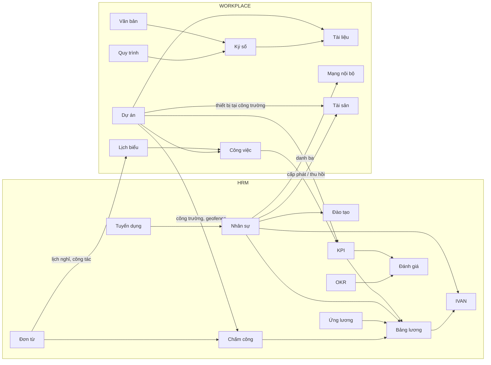

# 02. Đặc tả chức năng các module

Quy ước:

- **MVP** — chức năng có trong lần phát hành đầu tiên của module.
- **Mở rộng** — làm sau khi module đã vận hành ổn định (trong cùng giai đoạn nếu kịp, hoặc giai đoạn sau).
- **Đặc thù VIJAKO** — yêu cầu riêng của doanh nghiệp thi công xây dựng.
- **GĐ** — giai đoạn triển khai, xem [04 — Lộ trình](04-lo-trinh-trien-khai.md).

---

## A. Nền tảng lõi (dùng chung cho mọi module) — GĐ0

| Thành phần | Chức năng |
|-----------|-----------|
| **Cơ cấu tổ chức** | Cây tổ chức nhiều cấp (Công ty → Khối → Phòng ban / Ban chỉ huy công trường), chức danh, cấp bậc, quản lý trực tiếp, kiêm nhiệm nhiều vị trí, lịch sử thay đổi cơ cấu |
| **Tài khoản & đăng nhập** | Đăng nhập SSO (Microsoft 365 / Google Workspace) hoặc tài khoản nội bộ, xác thực 2 lớp (bắt buộc với quản trị, C&B, BGĐ), quản lý phiên & thiết bị, khoá tài khoản tự động khi nghỉ việc |
| **Phân quyền** | Vai trò × quyền chức năng × phạm vi dữ liệu (cá nhân / phòng ban / phòng ban & cấp dưới / dự án / toàn công ty); quản trị viên riêng cho từng module — chi tiết tại [03](03-kien-truc-ky-thuat.md#4-phân-quyền) |
| **Workflow engine** | Động cơ phê duyệt dùng chung: luồng tuần tự / song song, điều kiện rẽ nhánh, người duyệt theo quản lý trực tiếp / chức danh / vai trò dự án, uỷ quyền, SLA & nhắc nhở, trả lại / chuyển tiếp / thêm người duyệt |
| **Biểu mẫu động** | Định nghĩa biểu mẫu bằng cấu hình (trường, kiểu dữ liệu, bắt buộc, công thức, bảng chi tiết), dùng cho Quy trình, Đơn từ, Đánh giá |
| **Thông báo** | Trong ứng dụng, push mobile, email, Zalo ZNS (tuỳ chọn); người dùng tự chọn kênh; gom thông báo (digest) để tránh làm phiền |
| **Lưu trữ file** | Upload (kể cả file lớn, tải lên nối tiếp), xem trước PDF / Office / ảnh, quét mã độc, phân quyền theo đối tượng chứa file |
| **Tương tác chung** | Bình luận, @nhắc tên, theo dõi, đính kèm — dùng thống nhất cho công việc, dự án, đề xuất, văn bản… |
| **Danh mục dùng chung** | Dự án/công trình, loại hợp đồng, ngày lễ, ngân hàng, tỉnh/thành, loại tài sản… |
| **Tìm kiếm toàn cục** | Tìm nhân viên, công việc, văn bản, tài liệu, dự án từ một ô tìm kiếm |
| **Nhật ký hệ thống** | Ghi nhận mọi thao tác thêm / sửa / xoá / xem dữ liệu nhạy cảm / phê duyệt |
| **App launcher & giao diện** | Màn hình chọn ứng dụng theo nhóm WORKPLACE / HRM (như ảnh tham chiếu), ẩn module chưa được cấp quyền, giao diện tiếng Việt / tiếng Anh |
| **Báo cáo & dashboard** | Khung báo cáo dùng chung, xuất Excel/PDF, dashboard theo vai trò |

---

## B. WORKPLACE

### B1. Mạng nội bộ — GĐ1

**Mục tiêu:** kênh truyền thông nội bộ chính thức, thay cho các nhóm Zalo / email rời rạc.

- **MVP**
  - Bảng tin: bài viết, ảnh / video, file đính kèm; thích, bình luận, @nhắc tên.
  - Thông báo chính thức: ghim, đối tượng nhận theo phòng ban / dự án, **bắt buộc xác nhận đã đọc** và theo dõi ai chưa đọc.
  - Nhóm theo phòng ban, dự án, chủ đề.
  - Danh bạ nội bộ & sơ đồ tổ chức (lấy từ Nhân sự).
  - Tự động: chúc mừng sinh nhật, kỷ niệm ngày vào công ty, chào mừng nhân sự mới.
- **Mở rộng:** khảo sát / bình chọn, vinh danh (kudos), sự kiện & đăng ký tham gia, kiểm duyệt bài trước khi đăng.
- **Đặc thù VIJAKO:** bản tin công trường (ảnh tiến độ từ module Dự án), thông báo an toàn lao động bắt buộc xác nhận.
- **Liên kết:** Nhân sự (danh bạ), Dự án (tin công trường), Lịch biểu (sự kiện), Văn bản (ban hành thông báo).

### B2. Công việc — GĐ1

**Mục tiêu:** giao việc và theo dõi việc hằng ngày minh bạch, không bỏ sót.

- **MVP**
  - Tạo / giao việc: người thực hiện, người phối hợp, người theo dõi, hạn hoàn thành, mức ưu tiên.
  - Việc con, checklist, đính kèm, bình luận, lịch sử thay đổi.
  - Trạng thái tuỳ biến theo nhóm; xem dạng Danh sách / Kanban / Lịch.
  - Việc định kỳ (hằng ngày / tuần / tháng); nhắc trước hạn & khi quá hạn.
  - Báo cáo việc quá hạn, tỷ lệ đúng hạn theo người / phòng ban.
- **Mở rộng:** Gantt và phụ thuộc giữa các việc, ghi nhận thời gian, mẫu công việc, giao việc từ biên bản họp.
- **Liên kết:** Dự án (việc gắn hạng mục công trình), Lịch biểu, KPI (tỷ lệ hoàn thành đúng hạn), OKR (việc gắn Key Result).

### B3. Dự án (công trình) — GĐ2

**Mục tiêu:** điều hành và theo dõi tiến độ công trình; **không** thay thế phần mềm dự toán / kế toán.

- **MVP**
  - Hồ sơ dự án: chủ đầu tư, gói thầu, địa điểm (kèm **toạ độ + bán kính geofence** dùng cho Chấm công), giá trị hợp đồng, thời gian, trạng thái.
  - Thành viên & vai trò dự án: chỉ huy trưởng, kỹ sư giám sát, QS, cán bộ ATLĐ, thủ kho… (dùng cho phân quyền theo dự án).
  - Cấu trúc hạng mục (WBS), tiến độ kế hoạch vs thực tế (Gantt), mốc quan trọng.
  - **Nhật ký thi công hằng ngày** trên mobile: thời tiết, nhân lực, thiết bị, công việc thực hiện, ảnh hiện trường có toạ độ & thời gian.
  - Báo cáo tuần / tháng tự tổng hợp từ nhật ký.
  - Nhật ký vấn đề / rủi ro, người xử lý, hạn xử lý.
  - Kiểm tra an toàn (checklist HSE), báo cáo sự cố / tai nạn.
- **Mở rộng:** yêu cầu nghiệm thu → biên bản → ký số; quản lý thầu phụ & hồ sơ thầu phụ; trình duyệt vật liệu / bản vẽ shop (submittal, RFI); dashboard danh mục dự án cho BGĐ; nhật ký offline.
- **Liên kết:** Công việc, Tài liệu (bản vẽ, hồ sơ), Chấm công (công theo dự án), Tài sản (thiết bị tại công trường), Ký số (biên bản), Mạng nội bộ.

### B4. Quy trình — GĐ1

**Mục tiêu:** số hoá mọi đề xuất / phê duyệt không thuộc module chuyên biệt.

- **MVP**
  - Thư viện mẫu quy trình dựng sẵn: đề xuất mua sắm / vật tư, đề nghị tạm ứng, đề nghị thanh toán (thầu phụ, nhà cung cấp), đề nghị công tác phí, đề xuất sửa chữa, đề xuất tuyển dụng.
  - Thiết kế biểu mẫu kéo thả (dùng biểu mẫu động của nền tảng), có bảng chi tiết và trường tính toán.
  - Thiết kế luồng duyệt: tuần tự / song song, rẽ nhánh theo **giá trị đề xuất, phòng ban, dự án**; người duyệt theo quản lý trực tiếp, chức danh, chỉ huy trưởng dự án hoặc người cụ thể.
  - Uỷ quyền duyệt khi vắng mặt; SLA, nhắc và chuyển cấp khi quá hạn.
  - Duyệt nhanh trên mobile; theo dõi trạng thái; in phiếu PDF theo mẫu công ty.
- **Mở rộng:** số hoá quy trình ISO 9001 / 14001 theo từng bước; phiên bản quy trình; báo cáo thời gian xử lý theo bước / người duyệt; tạo phiếu tự động từ module khác qua API.
- **Liên kết:** Workflow engine lõi, Ký số, Văn bản, Tài liệu, Dự án.

### B5. Tài liệu — GĐ3

**Mục tiêu:** kho tài liệu tập trung, phân quyền rõ ràng, thay thư mục chia sẻ / ổ cứng cá nhân.

- **MVP**
  - Không gian tài liệu: công ty / phòng ban / dự án / cá nhân; thư mục nhiều cấp.
  - Phân quyền thư mục & tệp: xem, tải, chỉnh sửa, quản lý; kế thừa quyền.
  - Phiên bản tài liệu, khoá khi đang sửa, khôi phục phiên bản cũ.
  - Xem trước PDF, Word, Excel, ảnh ngay trên trình duyệt / mobile.
  - Chia sẻ liên kết nội bộ có thời hạn; thùng rác; hạn mức dung lượng.
  - Tìm kiếm theo tên, thẻ, nội dung (kể cả PDF scan qua OCR).
- **Mở rộng:** tài liệu kiểm soát ISO (mã tài liệu, lần ban hành, danh sách phân phối, xác nhận đã đọc); xem bản vẽ DWG; soạn thảo trực tuyến; watermark khi tải xuống.
- **Liên kết:** Dự án, Văn bản, Quy trình, Ký số.

### B6. Ký số — GĐ2

**Mục tiêu:** ký số hợp pháp trên văn bản, hợp đồng, biên bản ngay trong hệ thống.

- **MVP**
  - Tích hợp **ký số từ xa** (remote signing) với tổ chức cung cấp dịch vụ chứng thực được cấp phép (VNPT SmartCA, Viettel MySign, FPT CA, BKAV…) cho chữ ký cá nhân và chữ ký tổ chức.
  - Luồng ký nhiều người (tuần tự / song song); **ký nháy** nội bộ trước khi lãnh đạo ký chính thức.
  - Đặt vị trí chữ ký trên PDF; chữ ký hiển thị (hình chữ ký + thông tin người ký, thời gian).
  - Kiểm tra hiệu lực chữ ký trên tài liệu; lưu vết toàn bộ quá trình ký; ký hàng loạt.
- **Mở rộng:** gửi tài liệu cho đối tác bên ngoài ký (chủ đầu tư, thầu phụ) qua liên kết; USB token; dấu thời gian (TSA); lưu trữ dài hạn có kiểm chứng.
- **Pháp lý:** Luật Giao dịch điện tử 2023 và nghị định hướng dẫn về chữ ký điện tử, dịch vụ tin cậy.
- **Liên kết:** Văn bản, Quy trình, Dự án (biên bản nghiệm thu), Nhân sự (hợp đồng lao động điện tử).

### B7. Lịch biểu — GĐ1

- **MVP**
  - Lịch cá nhân / phòng ban / công ty; tạo lịch họp, mời họp, xác nhận tham dự.
  - Đặt phòng họp (chống trùng), đặt xe công; lịch công tác tuần của Ban Giám đốc.
  - Hiển thị các đơn nghỉ / công tác đã duyệt; nhắc lịch qua thông báo.
- **Mở rộng:** biên bản họp và giao việc từ cuộc họp; đồng bộ Outlook / Google Calendar; tạo liên kết họp trực tuyến; lịch kiểm tra công trường.
- **Liên kết:** Đơn từ, Công việc, Dự án, Mạng nội bộ (sự kiện).

### B8. Văn bản — GĐ2

**Mục tiêu:** quản lý văn bản đến, đi, nội bộ theo nghiệp vụ văn thư.

- **MVP**
  - **Văn bản đến:** tiếp nhận (scan / email), vào sổ, phân phối, giao xử lý, hạn xử lý, theo dõi tình trạng.
  - **Văn bản đi:** soạn thảo, trình duyệt (qua workflow), ký số, **cấp số tự động** theo sổ, phát hành, gửi.
  - **Văn bản nội bộ:** quyết định, thông báo, quy chế, quy định — ban hành và yêu cầu xác nhận đã đọc.
  - Sổ văn bản theo loại / năm; tra cứu theo số, trích yếu, ngày, đơn vị.
- **Mở rộng:** mẫu văn bản trộn dữ liệu, liên thông email, thống kê tình hình xử lý, lập hồ sơ lưu trữ.
- **Liên kết:** Ký số, Tài liệu, Quy trình, Mạng nội bộ.

### B9. Tài sản — GĐ3

**Mục tiêu:** biết tài sản / thiết bị nào, đang ở đâu, ai giữ, tình trạng ra sao.

- **MVP**
  - Danh mục tài sản & công cụ dụng cụ: văn phòng, CNTT, **máy móc thiết bị thi công**; mã **QR** cho từng tài sản.
  - Cấp phát / thu hồi cho nhân viên (biên bản bàn giao); **điều chuyển giữa phòng ban / công trường**.
  - Lịch sử sử dụng, bảo trì / sửa chữa; **kiểm định định kỳ** (thiết bị nâng hạ, giàn giáo…) kèm nhắc hạn.
  - Kiểm kê bằng quét QR trên mobile; theo dõi khấu hao tham khảo.
- **Mở rộng:** đề xuất mua / cấp phát qua Quy trình; thanh lý; thiết bị thuê ngoài; báo cáo hiệu suất sử dụng máy theo công trình.
- **Liên kết:** Nhân sự (thu hồi tài sản khi nghỉ việc), Dự án, Quy trình.

---

## C. HRM

### C1. Nhân sự — GĐ1

**Mục tiêu:** hồ sơ nhân sự chuẩn, là nguồn dữ liệu gốc cho toàn hệ thống.

- **MVP**
  - Hồ sơ nhân viên: thông tin cá nhân, CCCD, liên hệ, người phụ thuộc (giảm trừ gia cảnh), tài khoản ngân hàng, học vấn, bằng cấp, **chứng chỉ (ATLĐ, hành nghề xây dựng) có ngày hết hạn**, kinh nghiệm.
  - Hợp đồng lao động: loại, thời hạn, phụ lục; nhắc trước khi hết hạn.
  - Quá trình công tác: bổ nhiệm, điều chuyển, **luân chuyển công trường**, thay đổi lương, khen thưởng / kỷ luật.
  - Onboarding / offboarding theo checklist (tạo tài khoản, cấp tài sản, đào tạo hội nhập / thu hồi tài sản, khoá tài khoản).
  - Nhân viên tự cập nhật thông tin (HR duyệt); nhập dữ liệu từ Excel; báo cáo biến động nhân sự.
- **Mở rộng:** hợp đồng lao động điện tử (ký số); hồ sơ rút gọn cho công nhân thời vụ / tổ đội; dashboard nhân sự; hồ sơ sức khoẻ.
- **Liên kết:** gần như mọi module; đặc biệt Chấm công, Bảng lương, IVAN, Đào tạo, Đánh giá, Tài sản.

### C2. Đơn từ — GĐ1

- **MVP**
  - Loại đơn: nghỉ phép (năm, ốm, việc riêng có / không lương, chế độ), đi muộn / về sớm, quên chấm công / giải trình công, làm thêm giờ, công tác (công trường, ngoại tỉnh), đổi ca, làm việc từ xa.
  - **Quỹ phép tự động**: 12 ngày/năm + thâm niên theo Bộ luật Lao động 2019; quy tắc cộng dồn / chuyển phép / phép tạm ứng cấu hình được.
  - Luồng duyệt theo cấp quản lý (dùng workflow engine); duyệt nhanh trên mobile.
  - Đơn đã duyệt tự động cập nhật vào Chấm công và hiển thị trên Lịch biểu.
- **Mở rộng:** kiểm soát giới hạn giờ làm thêm theo quy định (cấu hình được); đơn thôi việc kích hoạt offboarding; báo cáo nghỉ phép / làm thêm.
- **Liên kết:** Chấm công, Lịch biểu, Bảng lương, Nhân sự.

### C3. Chấm công — GĐ1

- **MVP**
  - Ca làm việc & xếp ca: hành chính, ca công trường, ca linh hoạt; ngày lễ, ngày nghỉ.
  - **Chấm công mobile bằng GPS geofence theo từng công trường + ảnh selfie**; chống giả lập vị trí, ràng buộc thiết bị.
  - Đồng bộ **máy chấm công văn phòng** (vân tay / khuôn mặt).
  - **Chấm công hộ**: chỉ huy trưởng chấm cho tổ đội / người không có điện thoại.
  - Bảng công tháng tự tính (kết hợp dữ liệu chấm, đơn từ, lễ tết); giải trình; **chốt công** theo kỳ; xuất Excel.
- **Mở rộng:** nhận diện khuôn mặt có chống giả mạo (liveness); **chấm công offline** (lưu trên máy, đồng bộ khi có mạng); **công theo dự án** để phân bổ chi phí nhân công; chấm công bằng QR tại cổng công trường.
- **Pháp lý:** ảnh khuôn mặt / dữ liệu sinh trắc là dữ liệu cá nhân nhạy cảm — phải có sự đồng ý của người lao động và chính sách lưu giữ.
- **Liên kết:** Đơn từ, Nhân sự, Dự án, Bảng lương.

### C4. Tuyển dụng — GĐ2

- **MVP**
  - Đề xuất nhu cầu tuyển dụng (qua workflow), kế hoạch tuyển dụng.
  - Tin tuyển dụng; **trang tuyển dụng công khai** (vd. `tuyendung.vijako.vn` hoặc nhúng vào vijako.vn).
  - Nhận hồ sơ từ form ứng tuyển, email, nhập tay / Excel; chống trùng ứng viên.
  - Pipeline dạng Kanban: sàng lọc → phỏng vấn → offer → nhận việc; lịch phỏng vấn, phiếu đánh giá phỏng vấn.
  - Gửi email mời phỏng vấn / thư mời nhận việc theo mẫu.
  - **Chuyển ứng viên trúng tuyển sang Nhân sự** (không nhập lại).
- **Mở rộng:** ngân hàng ứng viên; đăng tin đa kênh; giới thiệu nội bộ; báo cáo hiệu quả kênh và chi phí tuyển dụng; hỗ trợ sàng lọc CV bằng AI (tuỳ chọn).
- **Liên kết:** Nhân sự, Quy trình, Lịch biểu, Đào tạo (hội nhập).

### C5. Đào tạo — GĐ2

- **MVP**
  - Kế hoạch đào tạo năm; khoá học nội bộ / bên ngoài; đăng ký hoặc chỉ định học viên.
  - Điểm danh, kết quả, chi phí; hồ sơ đào tạo của từng người.
  - **Quản lý chứng chỉ & cảnh báo hết hạn** (ATLĐ, hành nghề, vận hành thiết bị) — gửi danh sách cần huấn luyện lại.
- **Mở rộng:** học trực tuyến (bài giảng video, bài kiểm tra); đào tạo hội nhập bắt buộc; cam kết đào tạo & bồi hoàn; khung năng lực theo chức danh.
- **Liên kết:** Nhân sự, Tuyển dụng, Đánh giá.

### C6. Đánh giá — GĐ4

- **MVP**
  - Chu kỳ đánh giá: thử việc, định kỳ (6 tháng / năm).
  - Mẫu phiếu theo chức danh / cấp bậc; tự đánh giá → quản lý đánh giá → hội đồng hiệu chỉnh → xếp loại.
  - Lịch sử đánh giá trong hồ sơ nhân sự.
- **Mở rộng:** đánh giá 360°; lấy điểm từ KPI / OKR; kế hoạch phát triển cá nhân; làm đầu vào xét tăng lương / thưởng.
- **Liên kết:** Nhân sự, KPI, OKR, Bảng lương, Đào tạo.

### C7. IVAN (BHXH điện tử) — GĐ3

**Mục tiêu:** lập và nộp hồ sơ BHXH, BHYT, BHTN điện tử **thông qua nhà cung cấp dịch vụ I-VAN được cấp phép** —
hệ thống không tự đóng vai trò I-VAN.

- **MVP**
  - Thông tin BHXH của người lao động: mã số BHXH, mức đóng, lịch sử tham gia.
  - **Tự sinh danh sách báo tăng / giảm / điều chỉnh mức đóng** từ biến động Nhân sự và Bảng lương.
  - Xuất tệp theo mẫu biểu hiện hành; gửi qua API của nhà cung cấp I-VAN (ký bằng chữ ký số tổ chức); theo dõi kết quả.
  - Đối chiếu thông báo kết quả đóng BHXH hằng tháng.
- **Mở rộng:** hồ sơ hưởng chế độ ốm đau, thai sản; cấp lại sổ / thẻ.
- **Lưu ý:** Luật BHXH 2024 (hiệu lực 01/07/2025) kéo theo thay đổi mẫu biểu — mẫu và tỷ lệ đóng phải cấu hình được.
- **Liên kết:** Nhân sự, Bảng lương, Ký số.

### C8. Bảng lương — GĐ3

- **MVP**
  - Thành phần lương cấu hình được: lương cơ bản, lương đóng bảo hiểm, phụ cấp (công trường, đi lại, điện thoại, ăn ca, trách nhiệm…), thưởng, khấu trừ.
  - **Công thức lương dạng biểu thức** và nhiều mẫu bảng lương (văn phòng, công trường, khoán).
  - Lấy dữ liệu tự động từ Chấm công, Đơn từ, Ứng lương, Nhân sự.
  - Tính BHXH / BHYT / BHTN, thuế TNCN (biểu luỹ tiến, giảm trừ gia cảnh — **là tham số**, không viết cứng).
  - Duyệt bảng lương (workflow), khoá kỳ lương; phiếu lương gửi qua app / email có bảo mật.
  - Xuất **file chi lương theo mẫu ngân hàng** và dữ liệu hạch toán cho phần mềm kế toán.
- **Mở rộng:** quyết toán thuế TNCN cuối năm; chứng từ khấu trừ thuế điện tử; phân bổ chi phí lương theo dự án; thưởng KPI, lương tháng 13; mô phỏng lương.
- **Bảo mật:** mã hoá các trường lương, phân quyền chặt theo người / phòng ban, ghi nhật ký cả thao tác **xem**.
- **Liên kết:** Chấm công, Đơn từ, Ứng lương, Nhân sự, IVAN, KPI.

### C9. Ứng lương — GĐ3

- **MVP**
  - Người lao động tạo yêu cầu ứng lương trên mobile; hạn mức theo % lương hoặc theo ngày công đã làm trong kỳ, giới hạn số lần / tháng.
  - Duyệt (workflow) → kế toán xác nhận đã chi → **tự động khấu trừ** vào bảng lương kỳ tương ứng.
- **Mở rộng:** chi tự động qua ngân hàng / đối tác ứng lương.
- **Liên kết:** Bảng lương, Chấm công.

### C10. KPI — GĐ4

- **MVP**
  - Thư viện chỉ tiêu theo phòng ban / chức danh; giao KPI theo kỳ (tháng / quý / năm) với trọng số, chỉ tiêu, ngưỡng.
  - Cập nhật kết quả thủ công hoặc **tự động** từ Công việc, Dự án, Chấm công.
  - Duyệt kết quả, tính điểm tổng hợp, dashboard theo phòng ban.
- **Mở rộng:** phân rã KPI công ty → phòng ban → cá nhân; chuyển điểm KPI thành thưởng trong Bảng lương.
- **Liên kết:** Công việc, Dự án, Đánh giá, Bảng lương.

### C11. OKR — GĐ4

- **MVP**
  - Mục tiêu công ty / phòng ban / cá nhân theo quý; Key Result đo lường được; căn chỉnh mục tiêu cấp dưới với cấp trên.
  - Check-in hằng tuần, mức độ tự tin, tiến độ tự tính.
- **Mở rộng:** cây OKR toàn công ty; gắn Công việc / Dự án vào Key Result; báo cáo cuối quý.
- **Phân biệt với KPI:** KPI dùng để **đo hiệu suất và tính thưởng**; OKR dùng để **định hướng mục tiêu và tạo đột phá**, không gắn trực tiếp vào lương — tránh trùng lặp giữa hai module.
- **Liên kết:** Công việc, Dự án, Đánh giá.

---

## D. Liên kết giữa các module

### Các luồng nghiệp vụ xuyên module quan trọng

1. **Vòng đời nhân viên:** Tuyển dụng (trúng tuyển) → Nhân sự (tạo hồ sơ, tài khoản) → Tài sản (cấp phát) →
   Đào tạo (hội nhập, ATLĐ) → Đánh giá thử việc → Hợp đồng lao động (Ký số) → IVAN báo tăng → … →
   Đơn thôi việc → Tài sản (thu hồi) → IVAN báo giảm → khoá tài khoản.
2. **Từ công đến lương:** Ca làm việc → Chấm công + Đơn từ → Bảng công → chốt công → Bảng lương
   (+ Ứng lương, thưởng KPI) → duyệt → phiếu lương & file chi ngân hàng → IVAN / thuế TNCN.
3. **Văn bản đi:** Soạn thảo → duyệt (Quy trình) → ký nháy → Ký số → cấp số → phát hành → lưu Tài liệu → thông báo (Mạng nội bộ).
4. **Ngày làm việc tại công trường:** Chấm công GPS tại công trường → nhật ký thi công (Dự án) → cập nhật Công việc →
   đề xuất vật tư / tạm ứng (Quy trình) → kiểm tra an toàn → báo cáo ngày tự tổng hợp.
