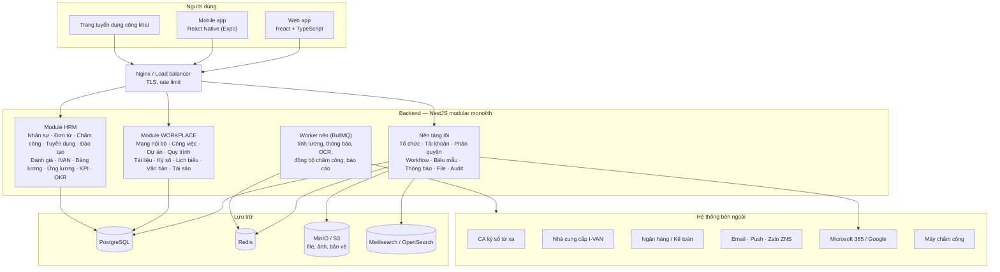
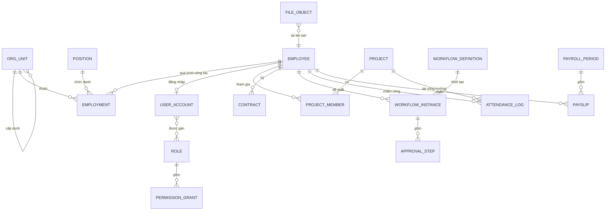

# 03. Kiến trúc & kỹ thuật

## 1. Kiến trúc tổng thể

**Đề xuất: Modular monolith** — một ứng dụng backend chia thành các module có ranh giới rõ ràng
(mỗi module một schema dữ liệu riêng, giao tiếp qua interface dịch vụ và sự kiện nội bộ).

Lý do chọn thay vì microservices:

- 20 module chia sẻ dữ liệu rất chặt (tổ chức, nhân viên, phân quyền, phê duyệt) — tách dịch vụ sớm làm tăng độ phức tạp mà không có lợi ích tương xứng.
- Đội dự án quy mô vừa (~12 người); triển khai, giám sát, gỡ lỗi một ứng dụng đơn giản hơn nhiều.
- Ranh giới module rõ ràng cho phép **tách thành dịch vụ riêng sau này** khi có nhu cầu thực sự (vd. Chấm công khi tải cao giờ vào ca, hay xử lý file / OCR).



## 2. Công nghệ đề xuất

| Tầng | Lựa chọn | Lý do |
|------|----------|-------|
| Web | React + TypeScript + Vite, **Ant Design** (bảng, biểu mẫu doanh nghiệp, có locale `vi_VN`), TanStack Query, React Router | Hệ sinh thái lớn, dễ tuyển người, bộ component phù hợp phần mềm quản trị |
| Mobile | **React Native (Expo)** | Dùng chung TypeScript, kiểu dữ liệu và API client với web; đủ GPS, camera, push, lưu offline |
| Backend | **Node.js 22 LTS + NestJS** (TypeScript) | Kiến trúc module + DI sẵn có, hợp modular monolith; một ngôn ngữ cho toàn đội. *Nếu đội mạnh Java/.NET, Spring Boot / ASP.NET Core là lựa chọn tương đương.* |
| ORM / migration | Prisma hoặc Drizzle | Kiểu dữ liệu an toàn, migration có kiểm soát |
| CSDL | **PostgreSQL 16** | Ổn định, JSONB cho biểu mẫu động, tìm kiếm cơ bản, sao lưu PITR |
| Cache & hàng đợi | **Redis 7 + BullMQ** | Phiên, cache, tác vụ nền (tính lương, gửi thông báo, OCR, đồng bộ) |
| Lưu trữ file | **MinIO** (tự host) hoặc S3-compatible của nhà cung cấp cloud | Tương thích S3, dễ chuyển đổi hạ tầng |
| Tìm kiếm | Meilisearch (đơn giản) hoặc OpenSearch (khi cần tìm nội dung tài liệu lớn) | Tìm kiếm tiếng Việt có / không dấu |
| Xem / sửa tài liệu | OnlyOffice Document Server, PDF.js | Xem trước & soạn thảo Office trên trình duyệt |
| Realtime | WebSocket (Socket.IO + Redis adapter) | Thông báo tức thời, cập nhật trạng thái duyệt |
| Thông báo | Expo Push (FCM / APNs), SMTP, Zalo ZNS | Đa kênh |
| Xác thực | OIDC / OAuth2, JWT ngắn hạn + refresh token, TOTP 2FA, SSO Microsoft 365 / Google | Đăng nhập một lần, bảo mật cao cho dữ liệu nhạy cảm |
| Hạ tầng | Docker, Docker Compose → Kubernetes khi cần mở rộng, GitHub Actions CI/CD | Đơn giản khi bắt đầu, có lộ trình mở rộng |
| Giám sát | Sentry (lỗi web / mobile / backend), Prometheus + Grafana, Loki (log), giám sát uptime | Phát hiện sự cố trước người dùng |
| Kiểm thử | Jest / Vitest (unit), Playwright (E2E web), Maestro hoặc Detox (E2E mobile), k6 (tải) | |

### Cấu trúc mã nguồn đề xuất (monorepo, pnpm + Turborepo)

```text
vijako-portal/
├── apps/
│   ├── web/              # React SPA: app launcher + giao diện 20 module
│   ├── mobile/           # React Native (Expo)
│   ├── careers/          # Trang tuyển dụng công khai
│   └── api/              # NestJS modular monolith
│       └── src/
│           ├── core/       # auth, org, iam, workflow, form, notification, file, audit, search, masterdata
│           ├── workplace/  # newsfeed, task, project, process, document, esign, calendar, dispatch, asset
│           └── hrm/        # employee, leave-request, attendance, recruitment, training, review,
│                           # insurance (ivan), payroll, salary-advance, kpi, okr
├── packages/
│   ├── ui/               # design system dùng chung (theme, component)
│   ├── api-client/       # client sinh tự động từ OpenAPI
│   ├── shared/           # kiểu dữ liệu, hằng số, schema validate (zod)
│   └── config/           # eslint, tsconfig, prettier
├── infra/                # docker, compose, k8s, script sao lưu
└── docs/
```

## 3. Thiết kế dữ liệu

### Nguyên tắc

- Mỗi module một **schema PostgreSQL riêng** (`core`, `task`, `project`, `attendance`, `payroll`…). Module chỉ tham chiếu
  trực tiếp tới bảng của `core` (tổ chức, nhân viên, người dùng); giữa các module nghiệp vụ dùng interface dịch vụ / sự kiện.
- Khoá chính UUID; mọi bảng có `created_at/by`, `updated_at/by`; xoá mềm cho dữ liệu nghiệp vụ.
- Dữ liệu biến động theo thời gian (lương, chức danh, phòng ban của nhân viên) lưu **theo hiệu lực** (`effective_from` / `effective_to`)
  để tính lương, báo cáo đúng tại mọi thời điểm.
- Dữ liệu nhạy cảm (lương, CCCD, số tài khoản, ảnh sinh trắc) **mã hoá ở mức trường**.
- Bảng chấm công, nhật ký hệ thống phân vùng (partition) theo tháng.

### Mô hình dữ liệu lõi



### Thực thể chính theo module

| Module | Thực thể chính |
|--------|----------------|
| Nền tảng | OrgUnit, Position, JobLevel, Employee, Employment, UserAccount, Role, PermissionGrant, WorkflowDefinition, WorkflowInstance, ApprovalStep, FormDefinition, Notification, FileObject, AuditLog |
| Mạng nội bộ | Post, Comment, Reaction, Group, Announcement, ReadReceipt |
| Công việc | Task, TaskAssignee, ChecklistItem, TaskStatus, RecurringRule |
| Dự án | Project, ProjectMember, WbsItem, Milestone, SiteDiary, SitePhoto, Issue, SafetyInspection, Incident |
| Quy trình | ProcessTemplate, ProcessRequest (dựa trên WorkflowInstance + dữ liệu biểu mẫu JSONB) |
| Tài liệu | Space, Folder, Document, DocumentVersion, FolderPermission, ShareLink |
| Ký số | SignRequest, Signer, SignatureField, SignEvent |
| Lịch biểu | Calendar, Event, Attendee, Room, Vehicle, Booking |
| Văn bản | DispatchBook, IncomingDispatch, OutgoingDispatch, InternalDocument, DispatchAssignment |
| Tài sản | Asset, AssetCategory, AssetAssignment, AssetTransfer, Maintenance, Inspection, StockTake |
| Nhân sự | EmployeeProfile, Dependent, BankAccount, Education, Certificate, Contract, Reward, Discipline, OnboardingChecklist |
| Đơn từ | LeaveType, LeavePolicy, LeaveBalance, LeaveRequest, OvertimeRequest, AttendanceAdjustment |
| Chấm công | Shift, ShiftSchedule, Geofence, Device, AttendanceLog, Timesheet, TimesheetLock |
| Tuyển dụng | Requisition, JobPosting, Candidate, Application, Interview, InterviewScore, Offer |
| Đào tạo | TrainingPlan, Course, CourseSession, Enrollment, TrainingResult, CertificateType |
| Đánh giá | ReviewCycle, ReviewTemplate, ReviewForm, ReviewScore, Rating |
| IVAN | InsuranceProfile, InsuranceChange, Declaration, DeclarationFile, SubmissionResult |
| Bảng lương | SalaryComponent, PayrollTemplate, Formula, PayrollPeriod, Payslip, PayslipLine, TaxSetting, InsuranceRate |
| Ứng lương | AdvancePolicy, AdvanceRequest, AdvanceDeduction |
| KPI | KpiLibrary, KpiAssignment, KpiResult, KpiPeriod |
| OKR | Objective, KeyResult, CheckIn, OkrCycle |

## 4. Phân quyền

Mô hình **RBAC + phạm vi dữ liệu**: `Quyền = Vai trò × Chức năng × Phạm vi`.

| Phạm vi | Ý nghĩa | Ví dụ |
|---------|---------|-------|
| Cá nhân | Chỉ dữ liệu của chính mình | Nhân viên xem phiếu lương của mình |
| Phòng ban | Dữ liệu của phòng ban mình | Trưởng phòng xem bảng công phòng mình |
| Phòng ban & cấp dưới | Phòng ban mình và các đơn vị trực thuộc | Giám đốc khối xem toàn khối |
| Dự án | Dữ liệu của các dự án mình là thành viên | Chỉ huy trưởng xem chấm công, nhật ký công trường mình |
| Toàn công ty | Không giới hạn | HR xem toàn bộ hồ sơ; BGĐ xem dashboard |

Quy tắc bổ sung:

- **Dữ liệu lương** là phân quyền riêng, không kế thừa từ quyền xem hồ sơ nhân sự; mặc định che (mask) trường lương.
- **Người duyệt** được xem nội dung phiếu mình cần duyệt dù không có quyền xem module.
- **Uỷ quyền** có thời hạn, ghi nhật ký người được uỷ quyền đã thao tác thay.
- Quản trị viên cấp module (vd. admin Chấm công) chỉ cấu hình được module của mình.
- Phân quyền kiểm tra ở **backend** cho mọi API; giao diện chỉ ẩn / hiện theo quyền.

## 5. Workflow engine (động cơ phê duyệt)

Là thành phần quan trọng nhất của nền tảng — dùng cho Đơn từ, Quy trình, Văn bản, Ký số, Ứng lương, Tuyển dụng, Bảng lương, Tài sản.
Đề xuất **tự xây engine phê duyệt dựa trên cấu hình JSON** (đủ cho nghiệp vụ phê duyệt, nhẹ hơn nhiều so với BPMN engine như Camunda).

- **Định nghĩa** (phiên bản hoá): danh sách bước, điều kiện rẽ nhánh, quy tắc xác định người duyệt, hành động khi hoàn tất.
- **Xác định người duyệt:** quản lý trực tiếp (N cấp), chức danh trong đơn vị, vai trò trong dự án, nhóm, người cụ thể, người đề xuất chọn.
- **Kiểu bước:** một người, song song "một người duyệt là đủ" / "tất cả phải duyệt", tuần tự.
- **Thao tác:** duyệt, từ chối, trả lại bổ sung, chuyển tiếp, thêm người duyệt, thu hồi, uỷ quyền.
- **SLA:** nhắc trước hạn, chuyển cấp khi quá hạn, báo cáo thời gian xử lý.
- **Hook:** khi hoàn tất bắn sự kiện cho module nghiệp vụ (vd. đơn nghỉ được duyệt → cập nhật Chấm công & Lịch biểu).

```json
{
  "code": "DE_NGHI_TAM_UNG",
  "version": 3,
  "steps": [
    { "id": "s1", "name": "Quản lý trực tiếp", "approver": { "type": "manager", "level": 1 } },
    { "id": "s2", "name": "Chỉ huy trưởng", "approver": { "type": "project_role", "role": "CHT" },
      "when": "form.projectId != null" },
    { "id": "s3", "name": "Kế toán trưởng", "approver": { "type": "position", "code": "KTT" } },
    { "id": "s4", "name": "Giám đốc", "approver": { "type": "position", "code": "GD" },
      "when": "form.amount > 50000000" }
  ],
  "sla": { "hoursPerStep": 24, "escalateTo": "manager" },
  "onApproved": ["notify:accounting", "event:advance.approved"]
}
```

## 6. Tích hợp bên ngoài

| Hệ thống | Mục đích | Cách tích hợp | GĐ |
|----------|----------|---------------|:--:|
| Microsoft 365 / Google Workspace | Đăng nhập một lần, lịch, email | OIDC, Graph API / Google Calendar API | GĐ0 / GĐ2 |
| Máy chấm công văn phòng (ZKTeco, Hikvision…) | Lấy dữ liệu chấm công | SDK / giao thức đẩy dữ liệu của hãng, đồng bộ định kỳ | GĐ1 |
| Push mobile, email, SMS, Zalo ZNS | Thông báo | FCM / APNs qua Expo, SMTP, API nhà cung cấp | GĐ0 – GĐ1 |
| CA ký số từ xa (VNPT SmartCA, Viettel MySign, FPT CA…) | Ký số cá nhân & tổ chức | API ký từ xa của CA; ký PAdES trên PDF | GĐ2 |
| Nhà cung cấp I-VAN | Nộp hồ sơ BHXH điện tử | API / tệp XML theo đặc tả của nhà cung cấp | GĐ3 |
| Ngân hàng chi lương | Chi lương | Xuất file theo mẫu ngân hàng (giai đoạn đầu); API ngân hàng doanh nghiệp (mở rộng) | GĐ3 |
| Phần mềm kế toán (MISA / Fast / Bravo…) | Hạch toán lương, tạm ứng | Xuất Excel theo mẫu import; API nếu phần mềm hỗ trợ | GĐ3 |
| Website vijako.vn | Đăng tin tuyển dụng | Trang tuyển dụng riêng hoặc widget nhúng / API đọc tin | GĐ2 |
| eKYC / nhận diện khuôn mặt (tuỳ chọn) | Chấm công khuôn mặt chống giả mạo | SDK on-device + API so khớp | GĐ1 mở rộng |

## 7. Bảo mật & tuân thủ

- **Chuẩn tham chiếu:** OWASP ASVS mức 2; kiểm thử xâm nhập (pentest) độc lập trước mỗi đợt go-live lớn (GĐ1, GĐ3).
- **Xác thực:** 2FA bắt buộc cho quản trị, C&B, kế toán, BGĐ; khoá tài khoản khi đăng nhập sai nhiều lần; chính sách mật khẩu; thu hồi phiên từ xa khi mất điện thoại.
- **Mã hoá:** TLS 1.2+ toàn bộ kết nối; mã hoá ổ đĩa; mã hoá trường dữ liệu nhạy cảm; khoá quản lý tách biệt.
- **Nhật ký:** audit log bất biến cho thao tác ghi, phê duyệt và **xem** dữ liệu lương / hồ sơ cá nhân; lưu tối thiểu 2 năm.
- **Dữ liệu cá nhân:** tuân thủ Luật Bảo vệ dữ liệu cá nhân 2025 và văn bản hướng dẫn — thông báo & lấy sự đồng ý (đặc biệt dữ liệu vị trí, sinh trắc), hồ sơ đánh giá tác động xử lý dữ liệu cá nhân, quy trình xử lý yêu cầu của chủ thể dữ liệu, chỉ định đầu mối bảo vệ dữ liệu.
- **Lưu trữ tại Việt Nam:** đặt máy chủ / cloud tại Việt Nam.
- **Mobile:** không lưu dữ liệu nhạy cảm dạng rõ trên máy, chống giả lập vị trí, phát hiện root / jailbreak cho chức năng chấm công.
- **Quy trình phát triển:** review mã bắt buộc, quét phụ thuộc có lỗ hổng, quét bí mật trong mã nguồn, tách cấu hình / bí mật khỏi mã.

## 8. Yêu cầu phi chức năng

| Hạng mục | Yêu cầu |
|----------|---------|
| Quy mô | 1.000 người dùng, ~300 đồng thời; đỉnh chấm công giờ vào ca ~500 lượt / 5 phút |
| Hiệu năng | API p95 < 500 ms; trang chính tải < 2 giây trên 4G; tính lương 1.000 người < 5 phút |
| Sẵn sàng | ≥ 99,5% trong giờ làm việc; bảo trì có báo trước ngoài giờ |
| Sao lưu | Sao lưu CSDL hằng ngày + WAL liên tục (khôi phục theo thời điểm); **RPO ≤ 15 phút, RTO ≤ 4 giờ**; bản sao lưu ngoài site; diễn tập khôi phục mỗi quý |
| Mobile | Android 9+, iOS 15+; chấm công & nhật ký hoạt động khi mất mạng và đồng bộ lại |
| Trình duyệt | Chrome, Edge, Safari, Firefox — 2 phiên bản mới nhất |
| Ngôn ngữ | Tiếng Việt (mặc định), tiếng Anh |
| Khả năng mở rộng | Thêm module mới không ảnh hưởng module cũ; API có phiên bản, tài liệu OpenAPI |

## 9. Hạ tầng triển khai

| Môi trường | Mục đích |
|-----------|----------|
| Dev | Môi trường phát triển chung, tự động deploy từ nhánh chính |
| Staging / UAT | Người dùng chủ chốt kiểm thử; dữ liệu đã ẩn danh |
| Production | Vận hành chính thức |

**Cấu hình production khởi điểm (tham khảo, cloud tại Việt Nam — Viettel IDC, FPT Cloud, VNPT, CMC…):**

- 2 máy ứng dụng (4 vCPU / 8 GB RAM) sau load balancer — chạy API, worker, web tĩnh.
- 1 máy CSDL chính (4 vCPU / 16 GB RAM, SSD) + 1 bản sao (replica) dự phòng.
- 1 máy Redis + search (2 vCPU / 4 GB RAM); OnlyOffice (4 vCPU / 8 GB RAM) từ GĐ3.
- Object storage 1–2 TB ban đầu (ảnh công trường và bản vẽ tăng nhanh — theo dõi và mở rộng theo nhu cầu).
- Sao lưu sang vùng / nhà cung cấp khác.
