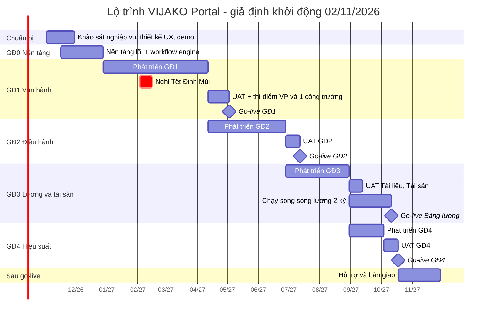

# 04. Lộ trình triển khai

## 1. Nguyên tắc phân giai đoạn

1. **Nền tảng trước, module sau** — workflow engine, tổ chức, phân quyền làm một lần, mọi module dùng lại.
2. **Giá trị hằng ngày trước** — GĐ1 gồm các module mọi nhân viên dùng mỗi ngày (chấm công, đơn từ, đề xuất, công việc) để tạo thói quen dùng hệ thống.
3. **Thay thế được hệ thống hiện tại sớm** — các module đang dùng (hiển thị sáng trong ảnh tham chiếu) nằm ở GĐ1–GĐ2.
4. **Lương đi sau chấm công** — Bảng lương ở GĐ3 khi dữ liệu Nhân sự, Chấm công, Đơn từ đã vận hành ổn định vài kỳ; chạy song song 2 kỳ trước khi chính thức.
5. **Mỗi giai đoạn go-live độc lập**, có cổng đánh giá (phase gate) trước khi sang giai đoạn sau.

## 2. Tổng quan các giai đoạn

| Giai đoạn | Phạm vi | Thời lượng | Go-live dự kiến* |
|-----------|---------|:----------:|:----------------:|
| **GĐ0 — Khởi động & nền tảng** | Khảo sát nghiệp vụ, thiết kế UX & design system, bản demo click-through; nền tảng lõi (tổ chức, tài khoản/SSO, phân quyền, workflow engine, biểu mẫu động, thông báo, file, audit), khung web + mobile, CI/CD, hạ tầng | 8 tuần | — (nội bộ) |
| **GĐ1 — Vận hành hằng ngày** | Nhân sự, Đơn từ, Chấm công, Quy trình, Công việc, Lịch biểu, Mạng nội bộ + mobile app | 13 tuần + 2 tuần Tết + 3 tuần UAT/thí điểm | **03/05/2027** (đầu kỳ công T5) |
| **GĐ2 — Điều hành & văn phòng điện tử** | Dự án, Văn bản, Ký số, Tuyển dụng (+ trang tuyển dụng), Đào tạo | 11 tuần + 2 tuần UAT | **12/07/2027** |
| **GĐ3 — Tiền lương & tài sản** | Bảng lương, Ứng lương, IVAN, Tài liệu, Tài sản | 9 tuần + 6 tuần chạy song song lương | Tài liệu, Tài sản: **09/2027** · Lương, Ứng lương, IVAN: **kỳ lương T10/2027** |
| **GĐ4 — Quản trị hiệu suất** | Đánh giá, KPI, OKR | 5 tuần + 2 tuần UAT | **18/10/2027** (chu kỳ chính thức đầu tiên: Q1/2028) |
| **Hỗ trợ sau go-live** | Hypercare, tối ưu, bàn giao vận hành | 6 tuần | đến 11/2027 |

\* Giả định khởi động **02/11/2026**, đội ~12–13 người (phương án A, mục 5). GĐ sau bắt đầu phát triển song song
với UAT của GĐ trước.

## 3. Chi tiết từng giai đoạn

### GĐ0 — Khởi động & nền tảng (8 tuần)

- **Tuần 1–4 (BA, UX):** workshop khảo sát theo nhóm nghiệp vụ (HCNS, C&B, kỹ thuật – công trường, văn thư, kế toán, BGĐ);
  thu thập biểu mẫu, quy trình, bảng lương mẫu, quy chế; chốt MVP từng module; thiết kế UX & design system;
  **bản demo click-through** (app launcher, hồ sơ nhân viên, tạo đơn – duyệt đơn, chấm công mobile) để BGĐ duyệt.
- **Tuần 3–8 (dev):** hạ tầng dev / staging, CI/CD; nền tảng lõi; khung web & mobile; import cơ cấu tổ chức và danh sách nhân viên mẫu.
- **Bàn giao:** tài liệu yêu cầu đã duyệt, thiết kế UX GĐ1, nền tảng lõi chạy trên staging, kế hoạch chuyển đổi dữ liệu.
- **Cổng đánh giá:** BGĐ duyệt demo & phạm vi GĐ1; đã chọn nhà cung cấp CA, I-VAN, cloud; key user đã được chỉ định.

### GĐ1 — Vận hành hằng ngày (≈ 18 tuần gồm Tết và UAT)

- **Phạm vi:** Nhân sự, Đơn từ, Chấm công (GPS + selfie, máy chấm công VP, chấm công hộ), Quy trình (mẫu dựng sẵn + thiết kế biểu mẫu/luồng), Công việc, Lịch biểu, Mạng nội bộ; ứng dụng mobile phát hành trên App Store / Google Play.
- **Chuyển đổi dữ liệu:** cơ cấu tổ chức, hồ sơ nhân viên, hợp đồng, **quỹ phép còn lại**, ca làm việc, danh sách công trường + toạ độ geofence, tài khoản người dùng.
- **Thí điểm:** văn phòng công ty + 1 công trường trong 2 tuần, sau đó triển khai toàn công ty từ đầu kỳ công.
- **Tiêu chí nghiệm thu:** 100% nhân viên có tài khoản và đăng nhập được; chấm công thí điểm khớp ≥ 99% với đối soát thủ công; không còn lỗi mức nghiêm trọng / cao; ≥ 90% đơn từ trong tháng đầu xử lý trên hệ thống.

### GĐ2 — Điều hành & văn phòng điện tử (≈ 13 tuần)

- **Phạm vi:** Dự án (hồ sơ, WBS/tiến độ, nhật ký thi công, issue, an toàn), Văn bản, Ký số (tích hợp CA đã chọn), Tuyển dụng + trang tuyển dụng công khai, Đào tạo (khoá học, chứng chỉ & nhắc hạn); mở rộng Đơn từ / Chấm công theo phản hồi GĐ1.
- **Chuyển đổi dữ liệu:** dự án đang thi công, sổ văn bản năm hiện hành, ứng viên đang tuyển, chứng chỉ ATLĐ / hành nghề.
- **Tiêu chí nghiệm thu:** văn bản đi phát hành có chữ ký số hợp lệ (kiểm tra được bằng công cụ của CA); 100% công trường đang thi công ghi nhật ký trên hệ thống; tin tuyển dụng đăng trên trang công khai và hồ sơ ứng viên chảy vào pipeline.

### GĐ3 — Tiền lương & tài sản (≈ 15 tuần gồm chạy song song)

- **Phạm vi:** Bảng lương, Ứng lương, IVAN, Tài liệu, Tài sản.
- **Chuyển đổi dữ liệu:** lịch sử lương 12 tháng gần nhất (phục vụ đối chiếu & quyết toán thuế), thông tin BHXH, danh mục tài sản (kiểm kê thực tế + dán mã QR), cây thư mục tài liệu dùng chung.
- **Chạy song song 2 kỳ lương:** C&B tính lương đồng thời trên hệ thống mới và cách hiện tại, đối soát từng người, từng khoản.
- **Tiêu chí nghiệm thu:** 2 kỳ song song khớp 100% (hoặc chênh lệch đã được giải thích và chấp nhận); file chi lương được ngân hàng chấp nhận; hồ sơ báo tăng / giảm BHXH nộp thành công qua I-VAN.

### GĐ4 — Quản trị hiệu suất (≈ 7 tuần)

- **Phạm vi:** Đánh giá, KPI, OKR; dashboard tổng hợp cho BGĐ.
- **Chuyển đổi dữ liệu:** bộ KPI hiện hành theo phòng ban, kết quả đánh giá năm gần nhất.
- **Ghi chú:** go-live 10/2027, chạy thử Q4/2027; chu kỳ KPI / OKR chính thức đầu tiên nên bắt đầu từ **Q1/2028** để khớp năm tài chính và kỳ đánh giá cuối năm.

## 4. Ước lượng nỗ lực phát triển

Đơn vị: **người-tháng (NT)** cho phát triển backend + web + mobile; chưa gồm PM, BA, UX, QC, DevOps (mục 5). Sai số ±30%.

| GĐ | Hạng mục | NT |
|----|----------|---:|
| GĐ0 | Tổ chức, tài khoản, SSO, phân quyền | 2,5 |
| GĐ0 | Workflow engine + biểu mẫu động | 3,0 |
| GĐ0 | Thông báo, file, audit, tìm kiếm, danh mục dùng chung | 2,0 |
| GĐ0 | Khung web + mobile, design system, CI/CD | 2,0 |
| GĐ1 | Nhân sự | 3,0 |
| GĐ1 | Đơn từ | 2,0 |
| GĐ1 | Chấm công (web + mobile + máy chấm công) | 4,0 |
| GĐ1 | Quy trình | 2,5 |
| GĐ1 | Công việc | 2,5 |
| GĐ1 | Lịch biểu | 1,5 |
| GĐ1 | Mạng nội bộ | 2,0 |
| GĐ2 | Dự án | 5,0 |
| GĐ2 | Văn bản | 2,5 |
| GĐ2 | Ký số | 2,0 |
| GĐ2 | Tuyển dụng + trang tuyển dụng | 2,5 |
| GĐ2 | Đào tạo | 2,0 |
| GĐ3 | Bảng lương | 4,0 |
| GĐ3 | Ứng lương | 1,0 |
| GĐ3 | IVAN | 2,0 |
| GĐ3 | Tài liệu | 2,5 |
| GĐ3 | Tài sản | 2,0 |
| GĐ4 | Đánh giá | 2,0 |
| GĐ4 | KPI | 2,0 |
| GĐ4 | OKR | 1,5 |
| Chung | Công cụ chuyển đổi dữ liệu, báo cáo & dashboard BGĐ | 4,0 |
| | **Tổng phát triển tính năng** | **≈ 62** |

Cộng thêm sửa lỗi, hỗ trợ UAT / go-live (~15 NT) và các vai trò PM, BA, UX, QC, DevOps, tổng nguồn lực dự án khoảng
**135–150 người-tháng** cho phương án A.

## 5. Đội dự án

### Phương án A — đội đầy đủ, ~12 tháng (khuyến nghị nếu cần thay hệ thống cũ sớm)

| Vai trò | Số lượng | Ghi chú |
|---------|:--------:|---------|
| Project Manager / Scrum Master | 1 | |
| Business Analyst | 1,5 | 1 BA Workplace/Dự án + 0,5 BA chuyên C&B (lương, BHXH, thuế) |
| UI/UX Designer | 1 → 0,5 | Toàn thời gian 3 tháng đầu, sau đó bán thời gian |
| Tech Lead / Kiến trúc sư | 1 | Kiêm phát triển phần lõi |
| Backend developer | 3 | |
| Frontend developer (web) | 2 | |
| Mobile developer | 1 | |
| QA / Tester | 2 | 1 kiểm thử thủ công + 1 kiểm thử tự động |
| DevOps | 0,5 | |
| **Tổng** | **~12–13** | |

### Phương án B — đội tinh gọn, ~20–22 tháng

PM/BA 1, Tech Lead 1, Backend 2, Frontend 1, Mobile 1, QA 1 (≈ 7 người). Giữ nguyên thứ tự giai đoạn; mỗi giai đoạn kéo dài
khoảng gấp đôi. Phù hợp nếu hệ thống hiện tại vẫn dùng được trong thời gian xây dựng.

### Phía VIJAKO cần cử

- **Nhà tài trợ dự án** (thành viên BGĐ) — chủ trì Ban chỉ đạo, họp 2 tuần / lần.
- **Product Owner** (đề xuất Trưởng phòng HCNS) — quyết định ưu tiên, duyệt yêu cầu, ~50% thời gian.
- **Người dùng chủ chốt (key user):** 1 người / phòng ban + 1 Ban chỉ huy công trường thí điểm — tham gia demo cuối sprint, UAT, đào tạo lại cho đồng nghiệp.

## 6. Cách thức làm việc

- **Scrum, sprint 2 tuần**; demo cuối sprint với Product Owner và key user trên môi trường staging.
- **Definition of Done:** mã đã review, có unit test cho nghiệp vụ, E2E cho luồng chính, tài liệu API, đã kiểm thử trên staging, không có lỗi mức cao.
- **Quản lý thay đổi:** yêu cầu mới ngoài phạm vi đi qua Product Owner → ước lượng → Ban chỉ đạo duyệt nếu ảnh hưởng mốc go-live.
- **Phát hành:** bật / tắt module bằng feature flag; phát hành mobile qua kênh beta nội bộ (TestFlight / Internal testing) trước khi lên store.
- **Nghiệp vụ C&B:** xây bộ **test case lương từ bảng lương thật** (đã ẩn danh) ngay từ GĐ0, chạy tự động mỗi lần thay đổi công thức.

## 7. Go-live, đào tạo & chuyển đổi

- **Chuyển đổi dữ liệu:** làm sạch dữ liệu ngay từ GĐ0 (bắt đầu với file Excel nhân sự); dùng mẫu import chuẩn; chạy thử import trên staging ít nhất 2 lần; đối soát số lượng và mẫu ngẫu nhiên trước cut-over.
- **Cut-over:** go-live đầu kỳ công / kỳ lương; khoá nhập liệu hệ thống cũ; giữ hệ thống cũ ở chế độ chỉ đọc tối thiểu 3 tháng.
- **Đào tạo:** đào tạo key user trước (train-the-trainer); video ngắn 2–3 phút cho từng thao tác; hướng dẫn ngay trong ứng dụng; buổi đào tạo trực tiếp tại công trường cho Ban chỉ huy.
- **Hỗ trợ:** nhóm hỗ trợ (helpdesk) trong 4–6 tuần sau mỗi go-live; kênh tiếp nhận lỗi / góp ý ngay trong ứng dụng.

## 8. Chi phí vận hành định kỳ cần dự trù

Không gồm chi phí xây dựng (= người-tháng × đơn giá của phương án VIJAKO chọn):

- Hạ tầng cloud (máy chủ, lưu trữ, sao lưu, băng thông) — tăng theo dung lượng ảnh / bản vẽ.
- Chứng thư số & dịch vụ ký số từ xa (theo số người ký / số lượt ký).
- Dịch vụ I-VAN (thuê bao năm).
- Zalo ZNS / SMS (theo số tin), email giao dịch.
- Tài khoản nhà phát triển Apple / Google; chứng chỉ SSL; công cụ giám sát.
- Bảo trì & phát triển tiếp: thường **15–20% chi phí xây dựng / năm**.

## 9. Rủi ro & biện pháp

| # | Rủi ro | Khả năng | Ảnh hưởng | Biện pháp |
|---|--------|:--------:|:---------:|-----------|
| 1 | Phạm vi phình to (20 module + yêu cầu đặc thù phát sinh) | Cao | Cao | Chốt MVP từng module bằng văn bản; quy trình thay đổi qua Ban chỉ đạo; cổng đánh giá cuối mỗi giai đoạn |
| 2 | Người dùng công trường ngại dùng, điện thoại cấu hình thấp, sóng yếu | Cao | Cao | Giao diện tối giản, chấm công offline, chấm công hộ, thí điểm 1 công trường trước, key user tại công trường |
| 3 | Công thức lương phức tạp, sai lương làm mất niềm tin | Trung bình | Rất cao | BA chuyên C&B, bộ test case từ bảng lương thật, chạy song song 2 kỳ, C&B ký xác nhận trước khi chính thức |
| 4 | Dữ liệu chuyển đổi thiếu, sai | Cao | Trung bình | Làm sạch từ GĐ0, mẫu import có kiểm tra, chạy thử nhiều lần, đối soát |
| 5 | Phụ thuộc bên thứ ba (CA, I-VAN, máy chấm công, ngân hàng) | Trung bình | Trung bình | Chọn nhà cung cấp ở GĐ0, làm việc với sandbox sớm, luôn có phương án xuất file thủ công |
| 6 | Thay đổi pháp luật (BHXH, thuế TNCN, dữ liệu cá nhân) | Cao | Trung bình | Tham số hoá mức đóng, biểu thuế, mẫu biểu; theo dõi văn bản mới mỗi quý |
| 7 | Lộ lọt dữ liệu lương / cá nhân | Thấp | Rất cao | 2FA, mã hoá trường, phân quyền riêng cho lương, audit cả thao tác xem, pentest trước go-live |
| 8 | Phụ thuộc vào một vài thành viên chủ chốt | Trung bình | Cao | Tài liệu kiến trúc & nghiệp vụ, review chéo, mã nguồn và tài liệu thuộc sở hữu VIJAKO |
| 9 | Key user VIJAKO không đủ thời gian cho UAT | Trung bình | Cao | Cam kết lịch từ đầu dự án, Product Owner có quyền quyết định, UAT theo sprint thay vì dồn cuối |
| 10 | Tổng chi phí xây mới vượt dự kiến so với thuê phần mềm có sẵn | Trung bình | Cao | Đánh giá lại tại cổng GĐ1; với phần mang tính "hàng hoá" ưu tiên dùng dịch vụ có sẵn (ký số qua CA, nộp BHXH qua I-VAN) thay vì tự xây |

## 10. Chỉ số thành công

Theo dõi trên dashboard quản trị từ GĐ1, báo cáo Ban chỉ đạo hằng tháng:

- Tỷ lệ người dùng hoạt động hằng tuần (web / mobile), theo phòng ban và công trường.
- Số đơn từ / đề xuất xử lý trên hệ thống và thời gian duyệt trung bình.
- Tỷ lệ chấm công thành công lần đầu (không phải giải trình).
- Thời gian chốt công & tính lương mỗi kỳ; số điều chỉnh lương sau khi chi.
- Số chứng chỉ / kiểm định được cảnh báo trước hạn.
- Mức độ hài lòng người dùng (khảo sát sau 1 và 3 tháng go-live).

Chỉ tiêu cụ thể xem [01 — Tổng quan](01-tong-quan-pham-vi.md#chỉ-tiêu-đo-lường-đề-xuất-chốt-lại-sau-khảo-sát).

## 11. Bước tiếp theo (2–4 tuần tới)

1. VIJAKO trả lời các [câu hỏi cần chốt](01-tong-quan-pham-vi.md#7-câu-hỏi-cần-chốt-trước-khi-khởi-động) và xác nhận thứ tự ưu tiên module.
2. Chọn phương án đội dự án (A / B, in-house hay thuê ngoài) và duyệt ngân sách.
3. Chọn nhà cung cấp hạ tầng cloud, CA ký số, I-VAN.
4. Chỉ định nhà tài trợ dự án, Product Owner, key user; tổ chức kick-off.
5. Dùng **bản demo click-through** trong repo này ([`demo/`](../demo/README.md)): app launcher theo ảnh tham chiếu, hồ sơ nhân viên,
   tạo – duyệt đơn từ, chấm công mobile, đề xuất theo quy trình — để BGĐ duyệt trải nghiệm trước khi phát triển thật.
